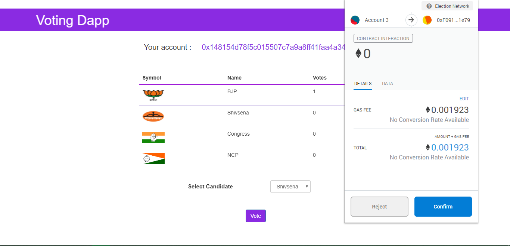
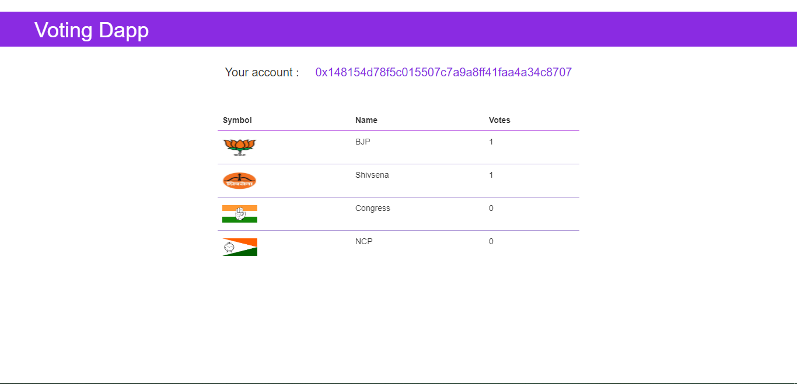
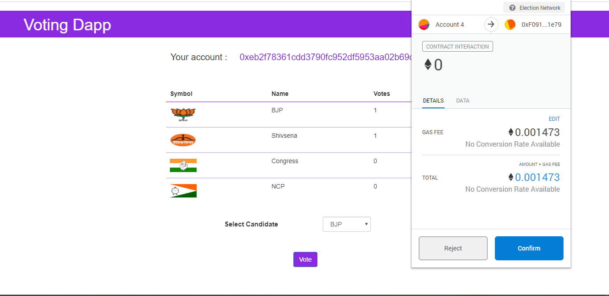
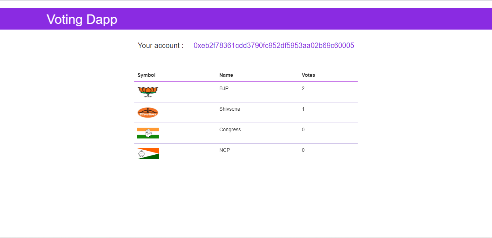

# voting-dapp
My first decentralized application, or Dapp, on the Ethereum Network. 
It is a voting dapp where a valid user can vote only once for a particular candidate which is made possible with the help of 
smart contracts written in solidity and also with the help of tools like truffle framework, ganache and metamask

User 1 voting in process => 

After User 1 has voted =>

User 2 voting in process =>

After User 2 has voted =>

